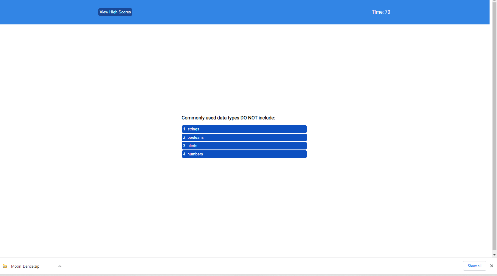
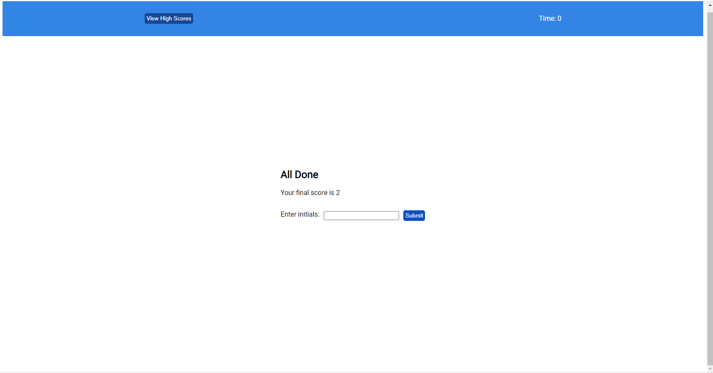

# Quiz Loader

## Description

This app have 5 mulitple choice questions and the ability to record and store high scores. 

## Installation

N/A

## Usage
User can start the quiz with 75 seconds to answer 5 mulitple choice questions. Any time the answer chooses it moves on to the next question. If the user answers correct it notifie As correct and user select  incorrectly, they are notified it is wrong and there is a penalty of 10 seconds off the timer. At the end of the quiz, user can record their name and  score. user can view all other scores that are recorded in the  storage. 

### Home  
When you click the button start quiz game will start

### questions
You can select mulitple choice.system shows it wright  or wrong

### 

You can Type yor name and click submit button

You can see your scores and you can check the high scores by cliking view high scotes buttion

### Completed version of the web site.

https://manojadikari.github.io/QuizLoader/

## Credits

N/A

## License
MIT license.
Please refer to the LICENSE in the repo.